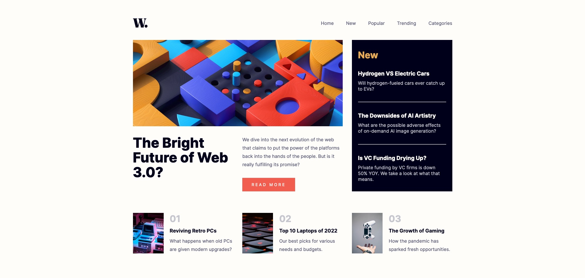

# Frontend Mentor - News homepage solution

This is a solution to the [News homepage challenge on Frontend Mentor](https://www.frontendmentor.io/challenges/news-homepage-H6SWTa1MFl). Frontend Mentor challenges help you improve your coding skills by building realistic projects.

## Table of contents

- [Overview](#overview)
  - [The challenge](#the-challenge)
  - [Screenshot](#screenshot)
  - [Links](#links)
- [My process](#my-process)
  - [Built with](#built-with)
  - [Useful resources](#useful-resources)
- [Author](#author)

## Overview

### The challenge

Users should be able to:

- View the optimal layout for the interface depending on their device's screen size
- See hover and focus states for all interactive elements on the page

### Screenshot

### Links

- Solution URL: [https://github.com/battistar/news-homepage-main](https://github.com/battistar/news-homepage-main)
- Live Site URL: [https://battistar.github.io/news-homepage-main/](https://battistar.github.io/news-homepage-main/)

## My process

### Built with

- Standard HTML, CSS, JS project
- Flexbox
- CSS Grid
- Mobile-first workflow

### Useful resources

- [CSS grid course](https://www.youtube.com/watch?v=BIx3XdHA8-Y&t=9656s) - Great video course to learn all about CSS grid by [Zach Gollwitzer](https://www.zachgollwitzer.com/)

## Author

- Website - [Samuele Battistella](https://battistar.github.io/)
- Frontend Mentor - [@battistar](https://www.frontendmentor.io/profile/battistar)
